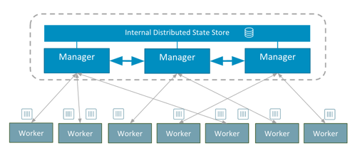

# What is Docker Swarm?

<p align="center">
  
</p>

## Orchestration
- The `portability and reproducibility` of a containerized process means we have an opportunity to `move and scale` our containerized applications across clouds and data centers. 
- Furthermore, as we scale our applications up, we’ll want some tooling to help automate the maintenance of those applications, able to replace failed containers automatically and manage the rollout of updates and reconfigurations of those containers during their lifecycle.
- Containers are great, but when you get lots of them running, at some point, you need them all working together in harmony to solve business problems.


- Docker Swarm is a container orchestration tool built and managed by Docker, Inc. 
- It is the native clustering tool for Docker. 
- Swarm uses the standard Docker API, i.e., containers can be launched using normal docker run commands and Swarm will take care of selecting an appropriate host to run the container on. 
- The tools that use the Docker API can use Swarm without any changes and take advantage of running on a cluster rather than a single host.


# But why do we need Container orchestration System?

Imagine that you had to run hundreds of containers. You can easily see that if they are running in a distributed mode, there are multiple features that you will need from a management angle to make sure that the cluster is up and running, is healthy and
more.

Some of these necessary features include:

● Health Checks on the Containers <br>
● Launching a fixed set of Containers for a particular Docker image<br>
● Scaling the number of Containers up and down depending on the load<br>
● Performing rolling update of software across containers<br>
● and more…<br>

Docker Swarm has capabilities to help us implement all those great features - all through simple CLIs.


# What is Docker Swarm?

- Docker Swarm is a container orchestration tool built and managed by Docker, Inc.
- It is the native clustering tool for Docker.
- Swarm uses the standard Docker API, i.e., containers can be launched using normal docker run commands and Swarm will take care of selecting an appropriate host to run the container on.
- The tools that use the Docker API—such as Compose and bespoke scripts—can use Swarm without any changes and take advantage of running on a cluster rather than a single host.


# How does Swarm Cluster look like?


A swarm is a group of machines that are running Docker and joined into a cluster. After that has happened, we continue to run the Docker commands we’re used to, but now they are executed on a cluster by a swarm manager. The machines in a swarm can be physical or virtual. After joining a swarm, they are referred to as nodes.

Swarm managers are the only machines in a swarm that can execute your commands, or authorize other machines to join the swarm as workers. Workers are just there to provide capacity and do not have the authority to tell any other machine what it can and cannot do.

Up until now, you have been using Docker in a single-host mode on your local machine. But Docker also can be switched into swarm mode, and that’s what enables the use of swarms. Enabling swarm mode instantly makes the current machine a swarm manager. From then on, Docker runs the commands you execute on the swarm you’re managing, rather than just on the current machine.

Swarm managers can use several strategies to run containers, such as “emptiest node” -- which fills the least utilized machines with containers. Or “global”, which ensures that each machine gets exactly one instance of the specified container. 

A swarm is made up of multiple nodes, which can be either physical or virtual machines. The basic concept is simple enough: run docker swarm init to enable swarm mode and make our current machine a swarm manager, then run docker swarm join on other machines to have them join the swarm as workers. 

## Raft consensus in swarm mode

- Swarm birden fazla manaegr node destekler ve bu sayade yüksek erişilebilirliği sağlar.  Bir managerda sorun olursa diğer manager devreye girer ve proses devam eder.
- Bu manager nodelardan yalnızca bir tanesi lider olarak seçilidir ve tüm yönetim lider tarafından yapılır. Diğer manager nodelar pasif durumdadır. Siz pasif manager nodeların birine bir komut verip iş yapmasını isterseniz bu sadece proxy görevi görür ve komutu lider node a iletir.
-Ortamda birden fazla manager node olduğu durumlarda bir adet lider seçilmelidir. Swarm bunu otomatik olarak halleder ve bunun için Raft Consensus algoritmasını kullanır. Raft algoritması lider seçimi için kuralları belirler. Örnegin ortamda 5 manager olan bir durumda lider node bir şekilde ulaşılamaz hale gelirse belirli bir zaman sonra kalan 4 tane kendi aralarında oylama yaparak bir lider belirler ve artık swarm cluster ın yönetimi bu yeni lider tarafından sağlanır.
- Raft algoritması maksimum (N-1) / 2 sayıda replikanın devre dışı kalmasını tolere eder. Örnegin 5 swarm manager olarak kurgulanan bir yapıda 2 manager devre dışı kalırsa kalan 3 node kendi aralarında anlaşarak çalışmaya devam edecektir. Fakat 3 node devre dışı kalırsa kalan 2 node çoğunluğu sağlayıp anlaşacakları için sorun çıkacak ve managent altyapısı çalışmayacaktır.
- Raft algoritmasını düzgün çalışabilmesi ve lider seçiminin sorunsuz olabilmesi için ortamın her zaman tek sayıda manager nodela kurulmuş olması gerekir.Bu nedenle Docker Swarm 1,3,5,7 manager ile kurulmalıdır. 7 Fazla olduğunda işler karışabiliyor. 


---
## Practice 1 - Launch Docker Machine Instances and Connect with SSH
---
- Launch `five` Compose enabled Docker machines on Amazon Linux 2 with security group allowing SSH connections.

- Connect to your instances with SSH.

```bash
ssh -i "key.pem" ec2-user@<PUBLIC_IP_ADDRESS>
```

user data:
#! /bin/bash

yum update -y
amazon-linux-extras install docker -y
systemctl start docker
systemctl enable docker
usermod -a -G docker ec2-user
# install docker-compose
curl -L "https://github.com/docker/compose/releases/download/1.27.4/docker-compose-$(uname -s)-$(uname -m)" -o /usr/local/bin/docker-compose
chmod +x /usr/local/bin/docker-compose

## Practice 2 - Set up a Swarm Cluster with Manager and Worker Nodes

- Prerequisites (Those prerequisites are satisfied within cloudformation template in Part 1)

  - Five EC2 instances on Amazon Linux 2 with `Docker` and `Docker Compose` installed.

  - Set these ingress rules on your EC2 security groups:

    - HTTP port 80 from 0.0.0.0\0

    - TCP port 2377 from 0.0.0.0\0

    - TCP port 8080 from 0.0.0.0\0

    - SSH port 22 from 0.0.0.0\0 (for increased security replace this with your own IP)

- Change the hostname  of the nodes, so we can discern the roles of each nodes. For example, you can name the nodes (instances) like master, worker-1 and worker-2.

```bash
sudo hostnamectl set-hostname <node-name-manager-or-worker>
```

- Check if the docker is active or not from the list of docker info (should be inactive at first).

```bash
docker info
```

- Get the internal IP addresses of docker machines,  you find out the Private IPs either on the EC2 dashboard, or from the command line by running the following command. Response should be something like `172.31.42.71`.

```bash
hostname -i
```

- Initialize `docker swarm` with Private IP and assign your first docker machine as manager:

```bash
docker swarm init
# or
docker swarm init --advertise-addr <Private IPs>
```

> Output

```bash
Swarm initialized: current node (6gpbx6r9vxwp37hjcdi41bhuc) is now a manager.

To add a worker to this swarm, run the following command:

    docker swarm join --token SWMTKN-1-4yfmqmk2xvly7mczdi21cuuhmem34v4ytrnvvkhzfajlptp4rk-dkfxxv4bq48rxomjjsjoxo5f1 172.31.9.149:2377

To add a manager to this swarm, run 'docker swarm join-token manager' and follow the instructions.
```

- Check if the `docker swarm` is active or not and explain the swarm part of `docker info`.

```bash
docker info
```

> Output - Swarm part of `docker info`.

```text
 Swarm: active
  NodeID: kdo4jnfu5rzzxpqej7mnqnv3m
  Is Manager: true
  ClusterID: rbs71ftk1nnl91bo9k6cyotwa
  Managers: 1
  Nodes: 1
  Default Address Pool: 10.0.0.0/8
  SubnetSize: 24
  Data Path Port: 4789
  Orchestration:
   Task History Retention Limit: 5
  Raft:
   Snapshot Interval: 10000
   Number of Old Snapshots to Retain: 0
   Heartbeat Tick: 1
   Election Tick: 10
  Dispatcher:
   Heartbeat Period: 5 seconds
  CA Configuration:
   Expiry Duration: 3 months
   Force Rotate: 0
  Autolock Managers: false
  Root Rotation In Progress: false
  Node Address: 172.31.42.71
  Manager Addresses:
   172.31.42.71:2377
```

- Add 2 more nodes as manager to improve fault-tolerance. It is recommended to create clusters with an odd number of managers in Swarm, because a majority vote is needed between managers to agree on proposed management tasks according to `Raft Algorithm`. An odd—rather than even—number is strongly recommended to have a tie-breaking consensus. Having two managers is actually worse than having one.

- Get the manager token with `docker swarm join-token manager` command.

```bash
docker swarm join-token manager
```

> Output

```bash
To add a manager to this swarm, run the following command:

  docker swarm join --token SWMTKN-1-4yfmqmk2xvly7mczdi21cuuhmem34v4ytrnvvkhzfajlptp4rk-3zzm33eyq2gsj1sm0qnaygf8a 172.31.9.149:2377
```

- Add second and third Docker Machine instances as manager nodes, by connecting with SSH and running the given command above.

```bash
docker swarm join --token <manager_token> <manager_ip>:2377
```

- Add fourth and fifth Docker Machine instances as worker nodes. (Run `docker swarm join-token worker` command to get join-token for worker, if needed)

```bash
docker swarm join --token <worker_token> <manager_ip>:2377
```

- List the connected nodes in `Swarm` and explain difference between leader and other managers.

```bash
docker node ls
```
---
## Docker Swarm Definitions

### Nodes : 
- The docker swarm function recognizes two types of nodes, each with a different role within the docker swarm ecosystem:

    - `Manager Node`: The primary function of manager nodes is to assign tasks to worker nodes in the swarm. Manager nodes also help to carry out some of the managerial tasks needed to operate the swarm. Docker recommends a maximum of seven manager nodes for a swarm. 

    - `Worker Node`: In a docker swarm with numerous hosts, each worker node functions by receiving and executing the tasks that are allocated to it by manager nodes. By default, all manager nodes are also worker nodes and are capable of executing tasks when they have the resources available to do so.

    - `Services and Tasks`: A service is the definition of the tasks to execute on the manager or worker nodes. It is the central structure of the swarm system and the primary root of user interaction with the swarm. 

    - `Load balancing`: The swarm manager uses ingress load balancing to expose the services you want to make available externally to the swarm.
---
## Practice - Managing Docker Swarm Services
---
> Warning: If you have problem with `docker swarm` installation, you can use following link for lesson.
https://labs.play-with-docker.com

- Create a service for visualization. 

```bash
docker service create --name=viz --publish=8080:8080/tcp --constraint=node.role==manager --mount=type=bind,src=/var/run/docker.sock,dst=/var/run/docker.sock dockersamples/visualizer
```

- Learn which node is running `service viz` and check if the visualizer is running by entering `http://<ec2-host-name of this node>:8080` in a browser. (Nothing should be running)

```bash
docker service ps viz
```

- Start an `nginx service` with 5 replicas and show the replicas running on visualizer.

```bash
docker service create --name webserver --replicas=5 -p 80:80 -d nginx
```

- List services, explain what service is and the difference between container and service.

```bash
docker service ls
```

- Check if the `Nginx Web Server` is running by entering `http://<ec2-host-name-of-any-node>` in a browser.

- Display detailed information on service.

```bash
docker service inspect --pretty webserver
```

- List the tasks of service and explain what task is.

```bash
docker service ps webserver
```

- Fetch the logs of the service or a task.

```bash
docker service logs webserver
```

- Reboot a worker node and explain the last situation on visualizer app.

```bash
sudo reboot -f
```

- Scale up services and show the changes on visualizer app.

```bash
docker service scale webserver=10
```

- Scale down services and show the changes on visualizer app.

```bash
docker service scale webserver=3
```

- Remove service and show the changes on visualizer app.

```bash
docker service rm webserver
```


- Create service in `global mod`, show the changes on visualizer app and explain `global mod`.

```bash
docker service create --name glbserver --mode=global -p 80:80 nginx
```

- Remove a container and show that swarm creates a new task immediately.

```bash
docker container rm -f <containerid>
docker service ps glbserver
```

- Leave worker nodes from swarm and show the changes on visualizer app.

```bash
docker swarm leave
```

- Remove the `glbserver` service.

```bash
docker service rm glbserver
```

- Leave manager nodes from swarm

```bash
docker swarm leave --force
```

- Join manager and worker nodes again.

```bash
docker swarm join --token SWMTKN-1-1nkizkzhhqk4i7blzwww3znwhd0lqfsu3nlh9gl1pe7mco84up-5468yx80p9nfowv4eck0dqrvd 172.31.38.249:2377
```

## Practice - Updating and Rolling Back in Docker Swarm

- Create a new service of `gluobe/container-info:green` with 10 replicas.

```bash
docker service create --name techproedweb -p 80:80 --replicas=10 gluobe/container-info:green
```

- Explain `docker service update` command.

```bash
docker service update --help
```

- Update `gluobe/container-info:green` image with `gluobe/container-info:variable` image and explain the changes.

```bash
docker service update --detach --update-delay 5s --update-parallelism 2 --image gluobe/container-info:variable techproedweb
watch docker service ps techproedweb
 ```

- Revert back to the earlier state of `techproedweb` service and monitor the changes.

```bash
docker service rollback --detach techproedweb
watch docker service ps techproedweb
 ```

 - Remove the service.

```bash
docker service rm techproedweb
```
# Overlay Network


## Practice - Using Overlay Network in Docker Swarm

- List Docker networks and explain overlay network (ingress)

```bash
docker network ls
docker network inspect ingress
```

- Create a user defined overlay network.

```bash
docker network create -d overlay techpro-net
```

- Explain user-defined overlay network (techpro-net)

```bash
docker network inspect techpro-net
```

- Create a new service with 3 replicas.

```bash
docker service create --name webserver --network techpro-net -p 80:80 -d --replicas=3 gluobe/container-info:green
```

- List the tasks of `webserver` service, detect the nodes which is running the task and which is not.

```bash
docker service ps webserver
```


- Check the URLs of nodes that is not running the task with `http://<ec2-public-hostname-of-node>` in the browser and show that the app is not accessible.

- Add following rules to security group of the nodes to enable the ingress network in the swarm and explain `swarm routing mesh`. *All nodes participate in an `ingress routing mesh`. The `routing mesh` enables each node in the `swarm` to accept connections on published ports for any service running in the swarm, **even if there’s no task running on the node**. The routing mesh routes all incoming requests to published ports on available nodes to an active container.* [Using swarm mode routing mesh](https://docs.docker.com/engine/swarm/ingress/#bypass-the-routing-mesh)


  - For container network discovery -> Protocol: TCP,  Port: 7946, Source: security group itself

  - For container network discovery -> Protocol: UDP,  Port: 7946, Source: security group itself

  - For the container ingress network -> Protocol: UDP,  Port: 4789, Source: security group itself

- Check the URLs of nodes that is not running the task with `http://<ec2-public-hostname-of-node>` in the browser and show that the app is **now** accessible.


## Practice - Managing Sensitive Data with Docker Secrets

- Explain [how to manage sensitive data with Docker secrets](https://docs.docker.com/engine/swarm/secrets/).


- Create two files named `name.txt` and `password.txt`.

```bash
echo "User" > name.txt
echo "P@ssw0rd" > password.txt
```

- Create docker secrets for both.

```bash
docker secret create username ./name.txt
docker secret create userpassword ./password.txt
```

- List docker secrets.

```bash
docker secret ls
```

- Create a new service with secrets.

```bash
docker service create -d --name secretdemo --secret username --secret userpassword gluobe/container-info:green
```

- List the tasks and go to terminal of ec2-instance which is running `secretdemo` task.

```bash
docker service ps secretdemo
```

- Connect the `secretdemo` container and show the secrets.

```bash
docker container exec -it <container_id> sh
cd /run/secrets
ls
cat username
cat userpassword
```

- To update the secrets; create another secret using `standard input` and remove the old one.(We can't update the secrets.)

```bash
echo "qwert@123" | docker secret create newpassword -
docker service update --secret-rm userpassword --secret-add newpassword secretdemo
```

- To check the updated secret, list the tasks and go to terminal of ec2-instance which is running `secretdemo` task.

```bash
docker service ps secretdemo
```

- Connect the `secretdemo` container and show the secrets.

```bash
docker container exec -it <container_id> sh
cd /run/secrets
ls
cat newpassword
```

## Part 5 - Managing Docker Stack - Running WordPress as a Docker Stack

- Explain `Docker Stack`.


- Create a folder for the project and change into your project directory
    
```bash
mkdir wordpress
cd wordpress
```

- Create a file called `wp_password.txt` containing a password in your project folder.

```bash
echo "P@ssw0rd" > wp_password.txt
```

- Create a file called `docker-compose.yml` in your project folder with following setup and explain it.

```yaml
version: "3.8"

services:
    wpdatabase:
        image: mysql:latest
        environment:
            MYSQL_ROOT_PASSWORD: R1234r
            MYSQL_DATABASE: techprowp
            MYSQL_USER: techpro
            MYSQL_PASSWORD_FILE: /run/secrets/wp_password
        secrets:
            - wp_password
        networks:
            - techpro-net
    wpserver:
        image: wordpress:latest  
        depends_on:
            - wpdatabase
        deploy:
            replicas: 3
            update_config:
                parallelism: 2
                delay: 5s
                order: start-first
        environment:
            WORDPRESS_DB_USER: techpro
            WORDPRESS_DB_PASSWORD_FILE: /run/secrets/wp_password
            WORDPRESS_DB_HOST: wpdatabase:3306
            WORDPRESS_DB_NAME: techprowp
        ports:
            - "80:80"
        secrets:
            - wp_password
        networks:
            - techpro-net
networks:
    techpro-net:
        driver: overlay

secrets:
    wp_password:
        file: wp_password.txt
```

- Deploy a new stack.

```bash
docker stack deploy -c ./docker-compose.yml wptechpro
```

- List stacks.

```bash
docker stack ls
```

- List the services in the stack.

```bash
docker stack services wptechpro
```

- List the tasks in the stack

```bash
docker stack ps wptechpro
```

- Check if the `wordpress` is running by entering `http://<ec2-host-name>` in a browser.

- Remove stacks.

```bash
docker stack rm wptechpro
```